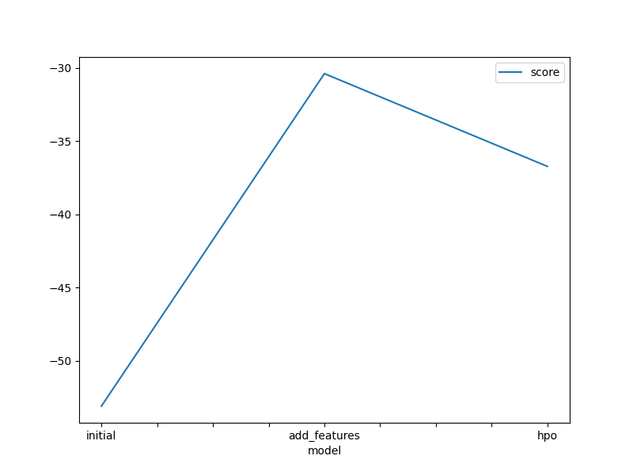
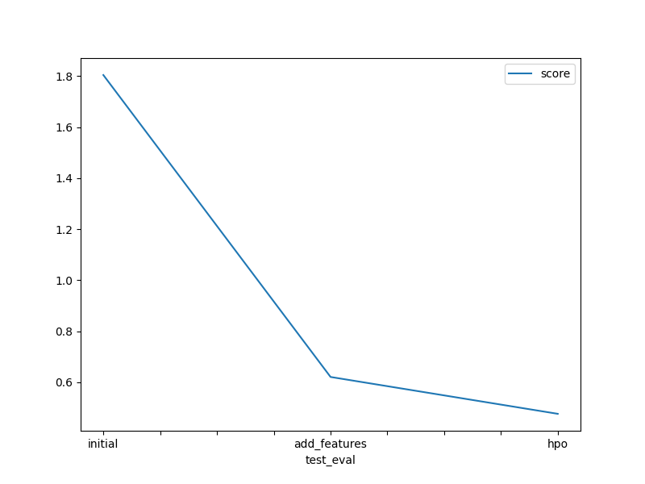

# Report: Predict Bike Sharing Demand with AutoGluon Solution

#### Deem Alqudaimi

  

## Initial Training

### What did you realize when you tried to submit your predictions? What changes were needed to the output of the predictor to submit your results?

I needed to remove negative values and replace them with a zero.

  

### What was the top ranked model that performed?

The best performing model was the `WeightedEnsemble_L3`.

  

## Exploratory data analysis and feature creation

### What did the exploratory analysis find and how did you add additional features?

There was a clear skew in the `windspeed and count` features. 
I extracted `year, month, day, and hour` from the `datetime` feature. I also changed the type of `season and weather` to categorical.

  

### How much better did your model preform after adding additional features and why do you think that is?

The model score and performance inhanced with the additional features. The score initially was 1.80431, and it dropped to 0.62067. I think the performance inhanced because the model did not process the date properly.

  

## Hyper parameter tuning

### How much better did your model preform after trying different hyper parameters?

After tuning the hyperparameters, the score dropped to 0.47620.

  

### If you were given more time with this dataset, where do you think you would spend more time?

I would create a custom model for this specific problem, focusing more on tuning the hyperparameters and increasing the training time.

  

### Create a table with the models you ran, the hyperparameters modified, and the kaggle score.

|model|training time|presets|hpo|score|
|---|---|---|---|---|
|initial|600|best\_quality|none|1\.80431|
|add\_features|600|best\_quality|none|0\.62067|
|hpo|900|best\_quality|NN\_TORCH:\[epochs, lr, activation, dropout\] &#124; GBM:\[boost\_rounds, leaves\] &#124; num\_trails &#124; scheduler &#124; searcher|0\.4762|

  

### Create a line plot showing the top model score for the three (or more) training runs during the project.

  

  

### Create a line plot showing the top kaggle score for the three (or more) prediction submissions during the project.

  

  

## Summary
**Three models were built:**
1. initial model:
	- baseline model
	- training time: 600 seconds
	- presets of `best_quality`
	- top model: `WeightedEnsemble_L3`
	- Kaggle score is 1.80431

2. add features model:
	- from `datetime`, I created `year, month, day, hour` columns
	- training time: 600 seconds
	- presets of `best_quality`
	- top model: `WeightedEnsemble_L3`
	- Kaggle score is 0.62067

3. hpo model:
	- added hyperparameters and tuned them:
		- NN_TORCH: [epochs, lr, activation, dropout]
		- GBM: [boost_rounds, leaves]
		- num_trails
		- scheduler
		- searcher
	- training time: 900 seconds
	- presets of `best_quality`
	- top model: `WeightedEnsemble_L3`
	- Kaggle score is 0.4762